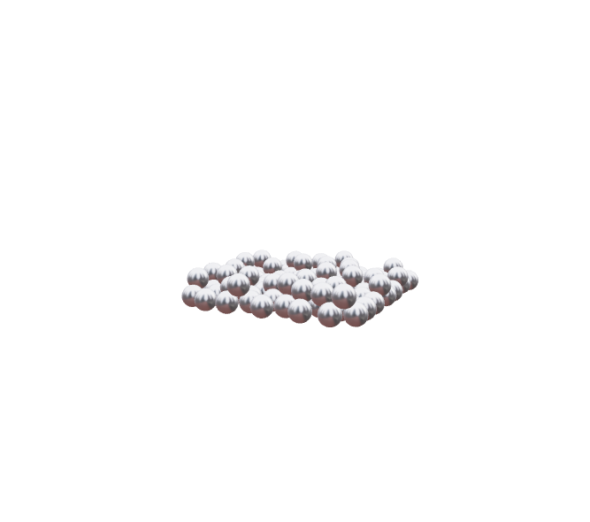

# Force physics

Basic collision detection using [Rapier](https://rapier.rs) including custom animations applying forces that follows mesh cursor paired with postprocessing effects.

[demo](https://force-physics.pages.dev/)